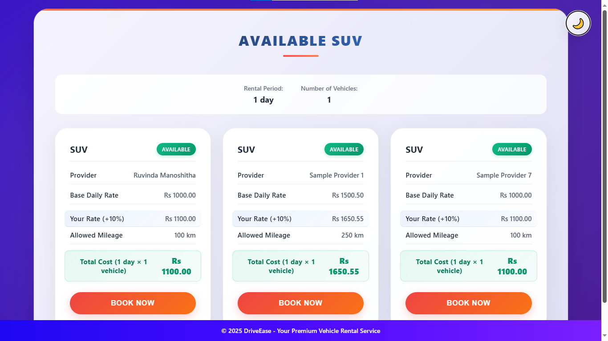
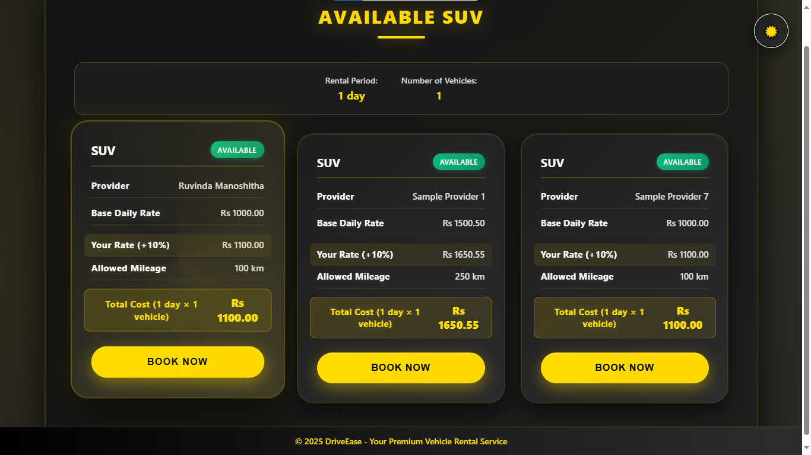
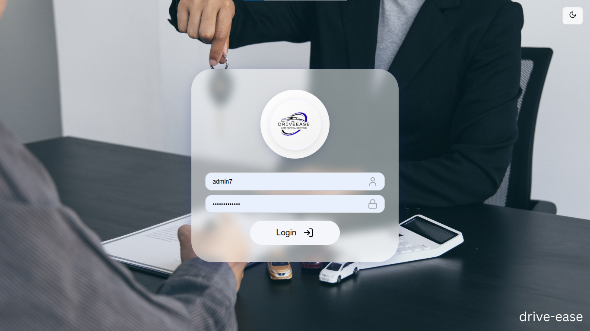
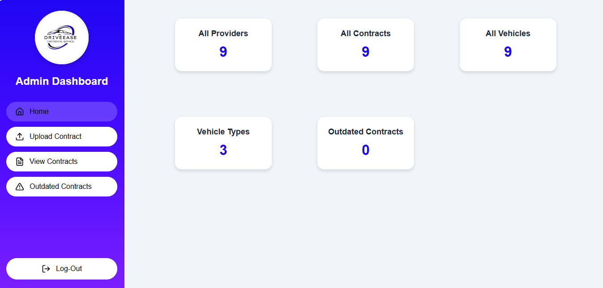
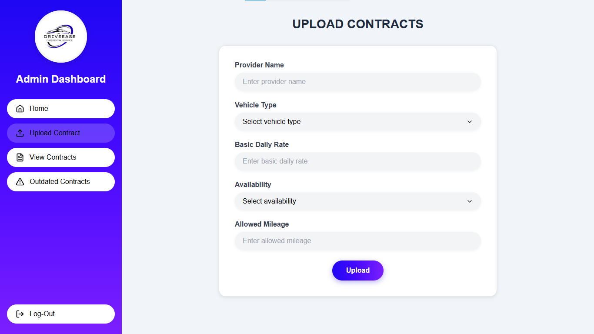
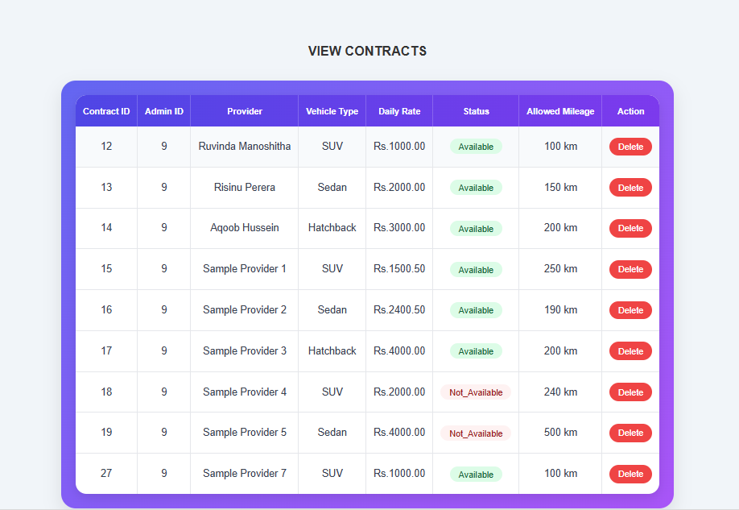
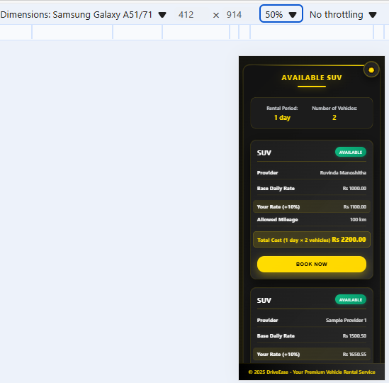

# 🚗 DriveEase – Car Rental System  

DriveEase is a **full-stack car rental platform** built with **React (frontend)** and **Spring Boot (backend)**.  
It allows users to **search, book, and manage rental vehicles**, while administrators can manage contracts, uploads, and booking records.  

---

## ✨ Features
- 🔑 **Admin Authentication** – Secure login for administrators.  
- 📄 **Contract Management** – Upload, view, and manage rental contracts.  
- 🚘 **Vehicle Booking** – Search, book, and manage car rentals.  
- 📊 **Admin Dashboard** – View analytics and manage bookings.  
- 📱 **Responsive Design** – Fully optimized for desktop and mobile.  

---

## 🖼️ UI Preview  

Here’s a preview of the application screens:  

| Home (Light) | Home (Dark) |
|--------------|-------------|
|  |  |

| Booking (Light) | Booking (Dark) |
|-----------------|----------------|
|  |  |

| Admin Login | Admin Dashboard |
|-------------|-----------------|
|  |  |

| Contract Uploads | View Contracts | Mobile Responsive |
|------------------|----------------|-------------------|
|  |  |  |

---

## 🛠️ Technologies Used  

### **Frontend (React)**  
- React.js  
- HTML5, CSS3, JavaScript  
- TailwindCSS / Bootstrap (UI framework)  
- Axios (API calls)  

### **Backend (Spring Boot)**  
- Spring Boot (REST API)  
- Spring Security + JWT (Authentication)  
- Hibernate / JPA (ORM)  
- MySQL (Database)  

---

## ⚙️ Installation & Setup  

### 1️⃣ Clone Repository  
```bash
git clone https://github.com/Ruvi7599/drive-ease-car-rental-system.git
cd drive-ease-car-rental-system
2️⃣ Frontend Setup (React)
bash
Copy code
cd Front-End
npm install
npm start
👉 Runs at: http://localhost:3000

3️⃣ Backend Setup (Spring Boot)
bash
Copy code
cd Back-End/drive_ease_new
./mvnw spring-boot:run
👉 Runs at: http://localhost:8080

4️⃣ Database Configuration (MySQL)
Create a database in MySQL:

sql
Copy code
CREATE DATABASE driveease;
Update application.properties in Spring Boot:

properties
Copy code
spring.datasource.url=jdbc:mysql://localhost:3306/driveease
spring.datasource.username=root
spring.datasource.password=yourpassword
spring.jpa.hibernate.ddl-auto=update
🚀 How to Run Project
Start MySQL database.

Run Backend (Spring Boot) on port 8080.

Run Frontend (React) on port 3000.

Access the app via:

http://localhost:3000 → Frontend

http://localhost:8080/api/v1/... → Backend APIs

📌 Recommendations for Future Development
Add payment integration for rentals.

Enable role-based access (Admin, Customer).

Deploy to Heroku (backend) + Vercel/Netlify (frontend) for production.

Add unit & integration tests.

📜 License
This project is licensed under the MIT License – see the LICENSE file for details.
